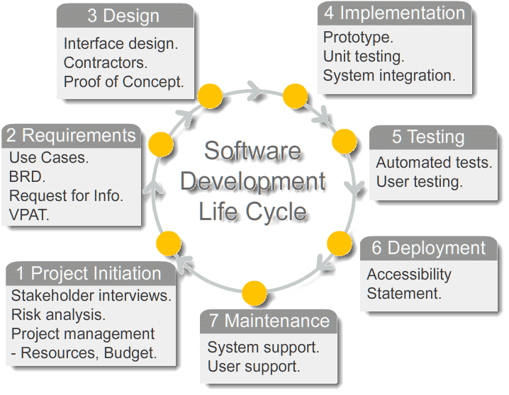

# What is Software Development Life Cycle – SDLC?

**Software Development Life Cycle** is a systematic approach to develop software. The purpose of SDLC process is producing a product with efficient cost and high quality.

## Different Stages of Software Development Life Cycle

### Stage 1: Planning of Project
This includes making reasonable estimates of the cost and size of the software product as compared to the resources at hand.

### Stage 2: Analysis & Requirement Gathering
The aim of requirement analysis is to capture the detail of each requirement so that everyone understands how each requirement is to be worked. This step includes:
- Collecting maximum information from the client about the desired product. 
- All details and specifications of the product must be discussed with the customer. 
- The development team analyses the requirements keeping in view the design and coding of the software. 
- The requirements so gathered are then analyzed for their validity and possibility of incorporating them into the software system. 

### Stage 3: Design
In this phase, program developer will:
- Analyses whether software can be prepared to fulfill all the requirements of the end user. 
- Checks that the project is financially, practically and technologically feasible for the customer. 
- Selects the program language like Java, Node etc...

### Stage 4: Development or Implementation
This is the longest phase of SDLC:
- Development team does the actual coding based on designed software 
- Writes unit tests for each component.
- The developer may show the work done to the business analysts and the modification or enhancements may be required. 

### Stage 5: Testing
This is the last phase of SDLC before the software is delivered to the customer. 
- The job of test team is to test the system against the requirements. 
- The aim of tester is to find out the gaps or defects within the system and also to verify that the software works as expected according to the requirements. 
- It includes Unit testing, Integration testing and System testing.

### Stage 6: Deployment
Once the Product is tested and ready to deploy, it is released to consumers to use. 
- The size of the project will determine the complexity of the deployment if required. 
- The users can be trained on, or aided with the documentation on how to operate the software. 
- A small round of testing is also performed on production to make sure of any environmental issues and any impact of new release.

### Stage 7: Maintenance
- When the customers start using the developed system, the actual problems comes up and needs to be solved from time to time. 
- This process where the care is taken for the developed product is known as Maintenance. 
- The software is maintained timely by updating the code according to the changes taking place in user end environment or technology.

## Different types of Software Development Life Cycle
### Waterfall Model 
The whole process of software development is divided into separate phases. Each phase must be completed before the next phase can begin and there is no overlapping in the phases.

#### Advantages of the Waterfall Model
- Easy to use,
- Easy to manage due to the rigidity of the model,
- Works well for smaller projects where requirements are very well understood.

#### Disadvantages of Waterfall Model
- Difficult to estimate time and cost for each phase
- Once an application is in the testing stage, it is very difficult to go back and change something,
- Not a good model for complex and object-oriented projects.
- Not suitable for the projects where requirements are at a moderate to high risk of changing.

### Iterative/Incremental Model
Iterative development is a way of breaking down the software development of a large application into smaller chunks. In iterative development, feature code is designed, developed and tested in repeated cycles. Making the life cycle a "multi-waterfall" cycle.

#### Advantages of the Iterative Model
- Allows partial utilization of the product and avoids a long development time,
- Generates working software quickly and early during the software life cycle,
- Flexible and less costly to change scope and requirements,
- Easier to test and debug as smaller changes are made during each iteration

#### Disadvantages of Iterative Model
- Needs good planning and design at every step,
- Needs a clear and complete definition of the whole system before it can be broken down and built incrementally,
- Total cost is higher than waterfall.

### Spiral Model
Spiral model is a combination of iterative development process model and  waterfall model with very high emphasis on risk analysis. It allows for incremental releases of the product, or incremental refinement through each iteration around the spiral.

#### Phases of Spiral Model
- Planning
- Risk Analysis
- Engineering
- Evaluation

#### Advantages of the Spiral Model
- Cost estimation becomes easy as prototype building is done in small segments,
- Development can be divided into smaller parts and more risky parts can be developed earlier which helps better risk management,
- Development is fast and features are added in a systematic way,
- There is always a room for customer feedback and the changes are implemented faster.

#### Disadvantages of Spiral Model
- It works best for large projects only and could be expensive for small projects, 
- Risk analysis is important phase so requires expert people for risk assessment.
- Documentation is more as it has large number of intermediate phases for its smooth operation spiral model protocol needs to be followed strictly.

#### When Spiral Model should be followed
- For medium and big projects.
- For high risk projects.
- Users are unsure of their needs
- Requirements are complex
- If requirements are more complicated.
- If frequent changes required in the project.

### V-Model
It is also known as Verification and Validation Model. Extension of the waterfall model. Instead of moving down in a linear way, the process steps are bent upwards after the coding phase, to form the typical V shape. 

#### Phases of V-model (*Verification*)
- Business Requirement Analysis
- Requirements Document
- System Design
- Architecture Design (*High Level Design*)
- Module Design

#### Validation Phases
- **Unit Testing**: Unit testing is the testing at code level and helps eliminate bugs at an early stage.
- **Integration Testing**: Verify that units created and tested independently can coexist and communicate among themselves within the system
- **System Testing**: System Test Plans are composed by client’s business team. System Test ensures that expectations from application developed are met.

#### Advantages of V-Model
- This is a highly disciplined model and Phases are completed one at a time.
- Easy to manage due to the rigidity of the model. Each phase has specific deliverables and a review process.
- Simple and easy to understand and use.
- Testing activities like planning, test designing happens well before coding. This saves a lot of time. Hence higher chance of success over the waterfall model.
- The implementation of testing starts right from the requirement phase, defects are found at early stage.
- Works well for small projects where requirements are easily understood.

#### Disadvantages of V-Model
- Very rigid and least flexible so adjusting scope is difficult and expensive.
- Software is developed during the implementation phase, so no early prototypes of the software are produced.
- Not suitable for the projects where requirements are at a moderate to high risk of changing.

### Big Bang Model
The Big Bang model is SDLC model where we do not follow any specific process. The development just starts with the required money and efforts as the input, and the output is the software developed which may or may not be as per customer requirement.

### Rapid Application Development (RAD) Model
It is a type of Incremental Model. RAD is a software development method that uses minimal planning in favor of rapid prototyping. The functional modules are developed simultaneously as prototypes and are integrated to make the complete product for faster product delivery. The customer gets early visibility in the software and can provide feedback on design, delivery, and other requirements. 

#### Phases of RAD Model
- Business Modeling
- Data Modeling
- Process  Modeling
- Application Generation

#### Advantages of RAD Model
- It reduces development time as all prototypes are developed in parallel.
- Increases reusability of components
- Quick initial reviews occur
- Encourages customer feedback as the customer gets early visibility.
- The reusability of components help to speed up development. 

#### Disadvantages of RAD Model
- Depends on strong team and individual performances for identifying business requirements.
- RAD can be useful only on the products that can be divided into functional modules.
- Requires highly skilled developers/designers.
- It cannot be used for cheaper projects as cost of modeling and automated code generation may be very high.

### Prototype Model 
The basic idea here is that instead of freezing the requirements before a design or coding can proceed, a throwaway prototype is built to understand the requirements. This prototype is developed based on the currently known requirements. 

#### Advantages of Prototype Model
- Sometimes it helps to demonstrate the concept to prospective investors to get funding for project.
- It reduces risk of failure, as potential risks can be identified early and corrective steps can be taken.
- Iteration between development team and client provides a very good and conductive environment during project.
- Since in this method a working model of the system is provided, the users get a better understanding of the system being developed and can suggest changes and modifications.
- User feedback is available at an early stage leading to better solution.

#### Disadvantages of Prototype Model
- If too many changes are required in the sample or model product, it can disturb the rhythm of the development team.
- This methodology may increase the complexity of the system as scope of the system may expand beyond original plans.
- Prototyping is usually done at the cost of the developer. So it should be done using minimal resources. Sometimes the start-up cost of building the development team, focused on making prototype, may be high.