# BASIC GIT

**Git** is a Version Control System (VCS). 

## Benefits of VCS
- Saving code history,
- Branching & merging,
- Traceability.

## Basic Git
### .gitignore
#### What is .gitignore?
`.gitignore` define folders/files will be ignored by git.

Examples:

- .idea: created by IntelliJ
- target: output folder, not related to code files.
- .DS_Store: created by OSX

#### 1. Create .gitignore for your project

Create a new .gitignore file in your project with below content:

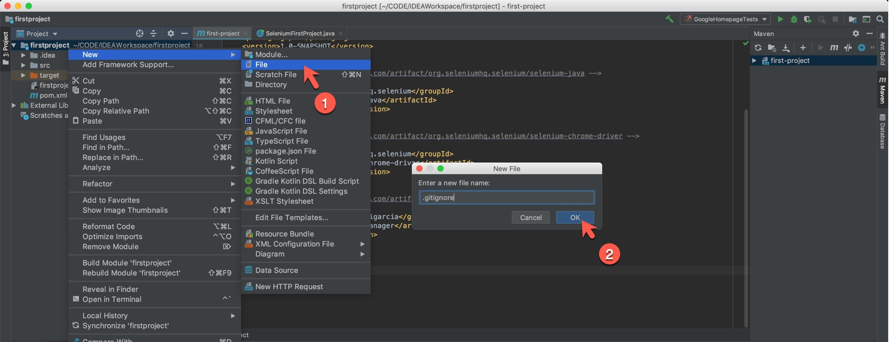

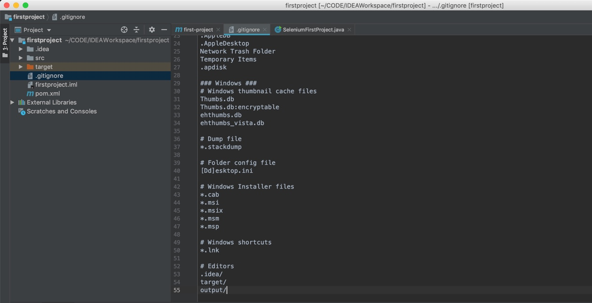


``` bash
### macOS ###
# General
.DS_Store
.AppleDouble
.LSOverride

# Icon must end with two \r
Icon

# Thumbnails
._*

# Files that might appear in the root of a volume
.DocumentRevisions-V100
.fseventsd
.Spotlight-V100
.TemporaryItems
.Trashes
.VolumeIcon.icns
.com.apple.timemachine.donotpresent

# Directories potentially created on remote AFP share
.AppleDB
.AppleDesktop
Network Trash Folder
Temporary Items
.apdisk

### Windows ###
# Windows thumbnail cache files
Thumbs.db
Thumbs.db:encryptable
ehthumbs.db
ehthumbs_vista.db

# Dump file
*.stackdump

# Folder config file
[Dd]esktop.ini

# Windows Installer files
*.cab
*.msi
*.msix
*.msm
*.msp

# Windows shortcuts
*.lnk

# Editors
.idea/
target/
output/
```
#### 2. Init repo (do only 1 time)

Open terminal in IntelliJ
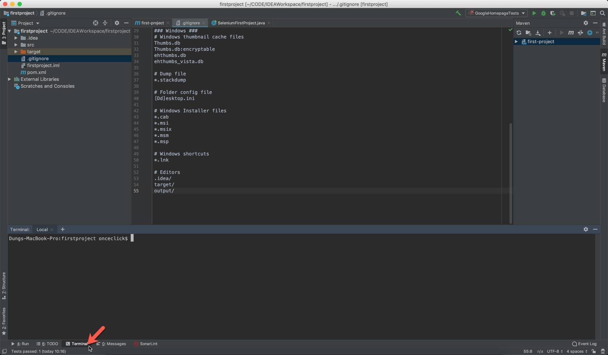

Type this command:
``` bash
git init    # Init repo
```
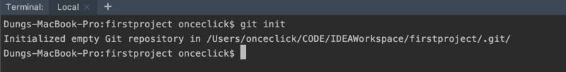

#### 3. Create first commit for your project 

Check current status *(do any time you want to check the status)*

``` bash
git status    # Check current status
```

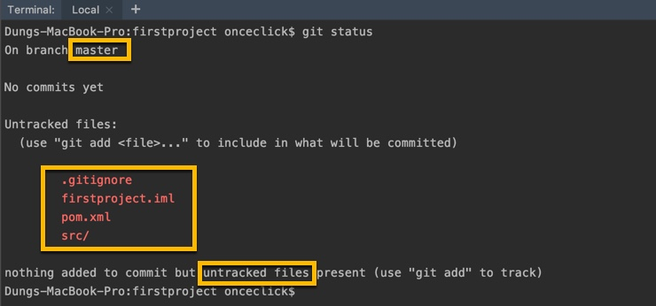
We are on master branch by default. We did not do any commits. All files are untracked.

``` bash
git add .       # Mark all untracked file ready to commits
git status      # Check current status
```
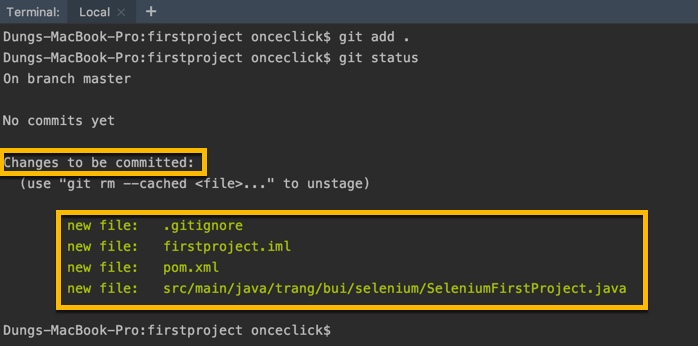

Create yout first commit to master branch
``` bash
git commit -m 'Init project'        # Create Commit
git status                          # Check current status
git log --all --graph --oneline     # Visual all commits
```

#### 4. Add readme.md file & create you second commit

Create readme.md file with any content to introduce your project. This file using [Markdown syntax](https://www.markdownguide.org/cheat-sheet/).

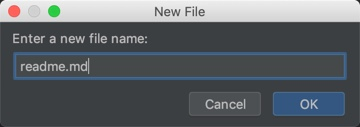

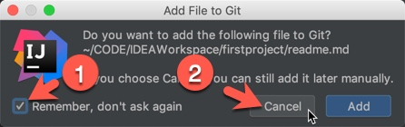

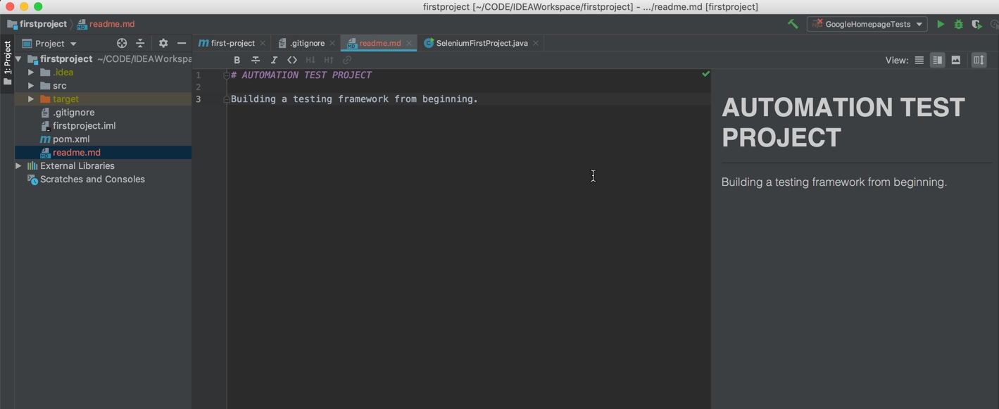

Creat second commit:
```bash
git status                          # Check current status
git add .                           # Mark all untracked file ready to commit
git status                          # Check status again
git commit -m 'Add readme.md file'  # Commit
git status                          # Check status again
git log --all --graph --oneline     # Visual all commits
```

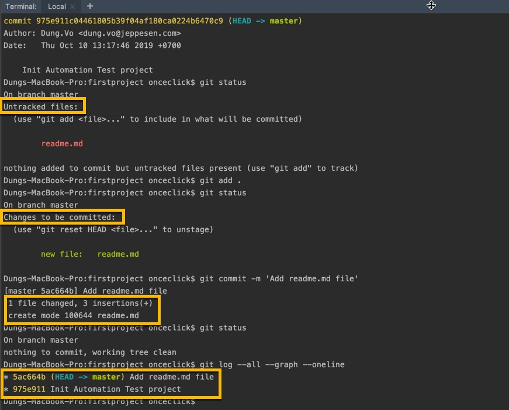

After you change you code. Create more commits as the second one.

#### 5. View your commit history using IntelliJ

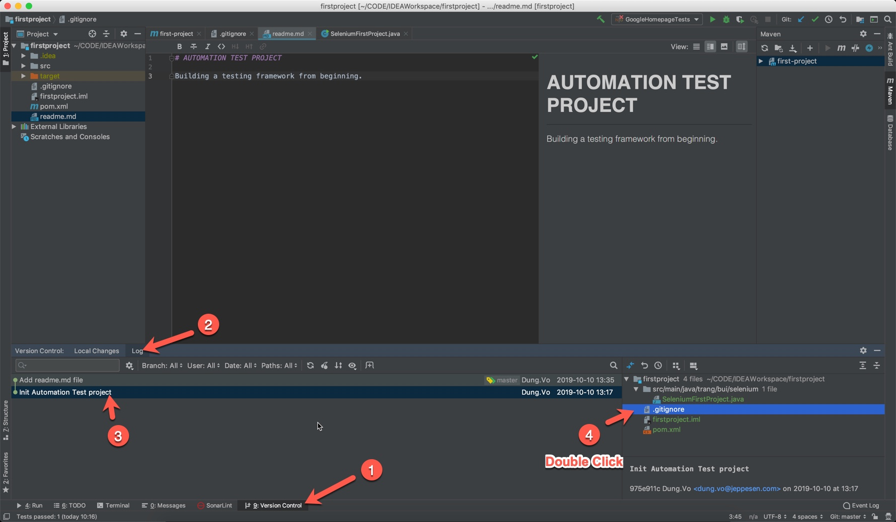

#### 6. Checkout a commit to a new branch
Make sure we have nothing to commit:
``` bash
git status                              # Check current status
```

If we have changed code, use this command to temporarily save:
 ``` bash
git stash                               # Store changed code to use later
```

#### 6.1 Checkout current commit to a new branch
``` bash
git checkout -b 'Branch-with-readme'    # Checkout current commit to a new branch
git status                              # Check current status
git branch                              # List branches
```
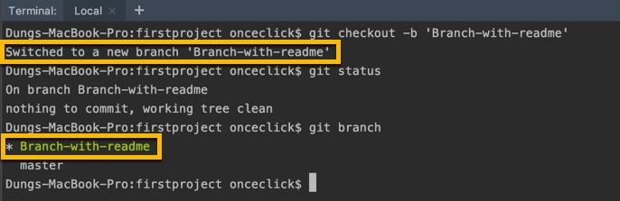

#### 6.2 Checkout a specific commit to a new branch
We will checkout to commit before we create readme.md
``` bash
git log --all --graph --oneline                     # Visual all commits
git checkout -b 'Branch-without-readme' 975e911     # Checkout 975e911 commit to a new branch
git branch                                          # List branches
git log --all --graph --oneline                     # Visual all commits
```
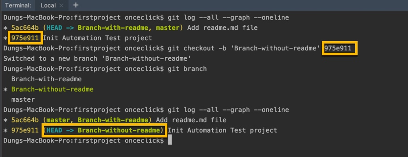
Check if you see the readme.md file?

#### 7. Checkout to an existing branch
We will checkout back to branch `Branch-with-readme`
``` bash
git branch                                          # List branches
git checkout 'Branch-with-readme'                   # Checkout to 'Branch-with-readme' branch
git log --all --graph --oneline                     # Visual all commits
```
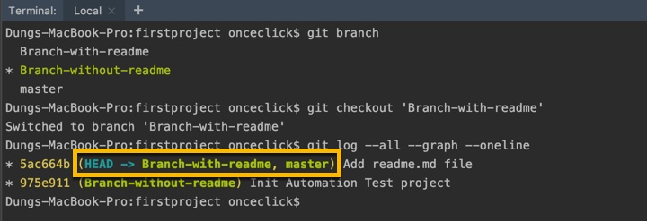
Check if you see the readme.md file?

#### 8. Delete a local branch
``` bash
git branch                                          # List branches
git branch -d 'Branch-without-readme'               # Delete  'Branch-without-readme' branch
git branch                                          # List branches
```
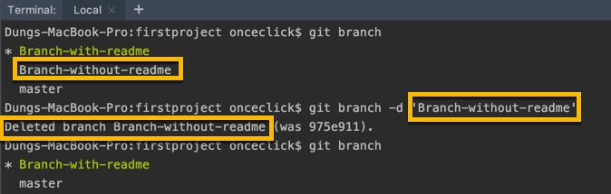

#### 9. Create account on Github & Bitbucket
Github and Bitbucket are best free Repository to save your code. Create your account on both these service:
- **Github**: [https://github.com/](https://github.com/)
- **Bitbucket**: [https://bitbucket.org/](https://bitbucket.org/)