# Selenium - Building common library

## 1. Create account on Github & Bitbucket
Github and Bitbucket are best free Repository to save your code. Create your account on both these service:
- **Github**: [https://github.com/](https://github.com/)
- **Bitbucket**: [https://bitbucket.org/](https://bitbucket.org/)

## 2. Create a new project on Github


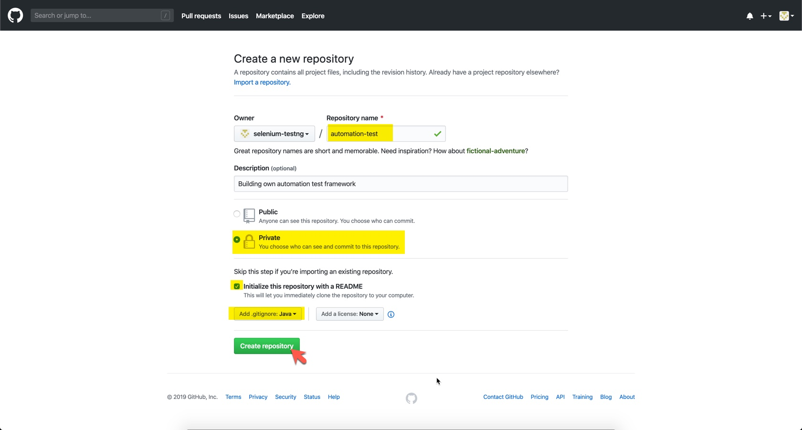


## 3. Clone project to local

``` bash
pwd                 # Check where are you?
# Clone project to local
git clone https://selenium-testng@github.com/selenium-testng/automation-test.git
cd automation-test  # Go in project folder
ls -la              # List files
```

## 4. Open project in IntelliJ and edit .gitignore

``` bash
# Compiled class file
*.class

# Log file
*.log

# BlueJ files
*.ctxt

# Mobile Tools for Java (J2ME)
.mtj.tmp/

# Package Files #
*.jar
*.war
*.nar
*.ear
*.zip
*.tar.gz
*.rar

# virtual machine crash logs, see http://www.java.com/en/download/help/error_hotspot.xml
hs_err_pid*

### macOS ###
# General
.DS_Store
.AppleDouble
.LSOverride

# Icon must end with two \r
Icon

# Thumbnails
._*

# Files that might appear in the root of a volume
.DocumentRevisions-V100
.fseventsd
.Spotlight-V100
.TemporaryItems
.Trashes
.VolumeIcon.icns
.com.apple.timemachine.donotpresent

# Directories potentially created on remote AFP share
.AppleDB
.AppleDesktop
Network Trash Folder
Temporary Items
.apdisk

### Windows ###
# Windows thumbnail cache files
Thumbs.db
Thumbs.db:encryptable
ehthumbs.db
ehthumbs_vista.db

# Dump file
*.stackdump

# Folder config file
[Dd]esktop.ini

# Windows Installer files
*.cab
*.msi
*.msix
*.msm
*.msp

# Windows shortcuts
*.lnk

# Editors
.classpath
.factorypath
.project
.idea/
.settings/
target/
output/
```
## 5. Commit & push code to Github

``` bash
git status                          # Check current status
git add .                           # Mark all files read to commit
git status                          # Check status again
git commit -m 'Update .gitignore'   # Commit
git push                            # Push code to remote repo (Github)
```

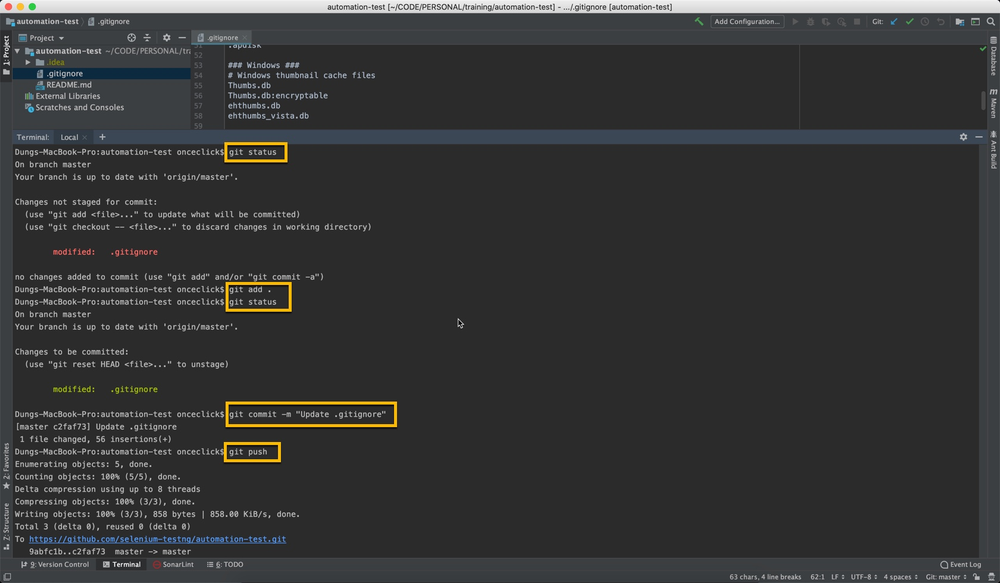

Check on Github

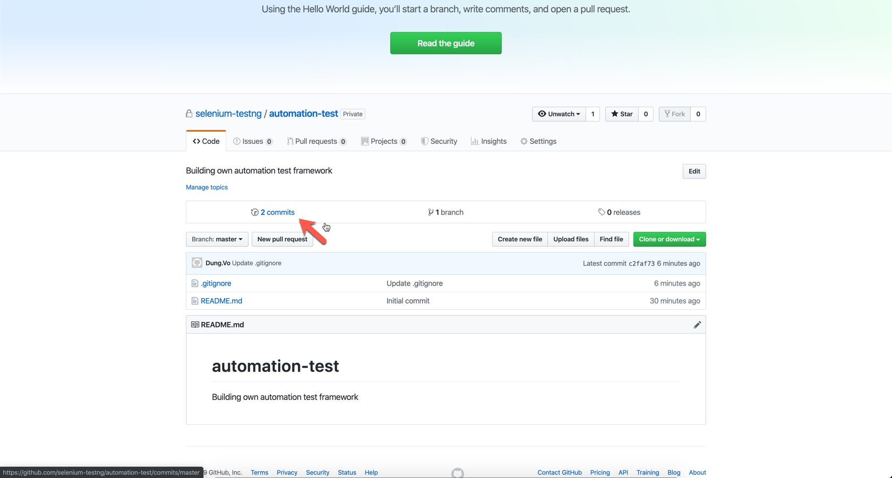

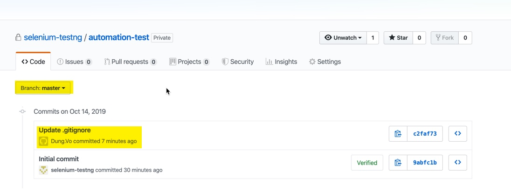


## 6. Update Project as Maven, update pom.xml to support selenium


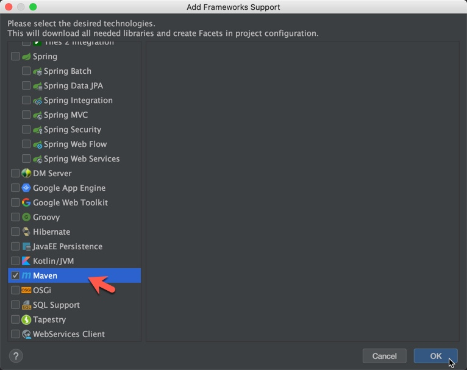


Update pom.xml to support selenium

```xml
<?xml version="1.0" encoding="UTF-8"?>
<project xmlns="http://maven.apache.org/POM/4.0.0"
         xmlns:xsi="http://www.w3.org/2001/XMLSchema-instance"
         xsi:schemaLocation="http://maven.apache.org/POM/4.0.0 http://maven.apache.org/xsd/maven-4.0.0.xsd">
    <modelVersion>4.0.0</modelVersion>

    <groupId>trang.bui.selenium</groupId>
    <artifactId>automation-test</artifactId>
    <version>1.0-SNAPSHOT</version>

    <dependencies>
        <!-- https://mvnrepository.com/artifact/org.seleniumhq.selenium/selenium-java -->
        <dependency>
            <groupId>org.seleniumhq.selenium</groupId>
            <artifactId>selenium-java</artifactId>
            <version>3.141.59</version>
        </dependency>

        <!-- https://mvnrepository.com/artifact/org.seleniumhq.selenium/selenium-chrome-driver -->
        <dependency>
            <groupId>org.seleniumhq.selenium</groupId>
            <artifactId>selenium-chrome-driver</artifactId>
            <version>3.141.59</version>
        </dependency>

        <!-- https://mvnrepository.com/artifact/io.github.bonigarcia/webdrivermanager -->
        <dependency>
            <groupId>io.github.bonigarcia</groupId>
            <artifactId>webdrivermanager</artifactId>
            <version>3.7.1</version>
        </dependency>

    </dependencies>
    
</project>
```

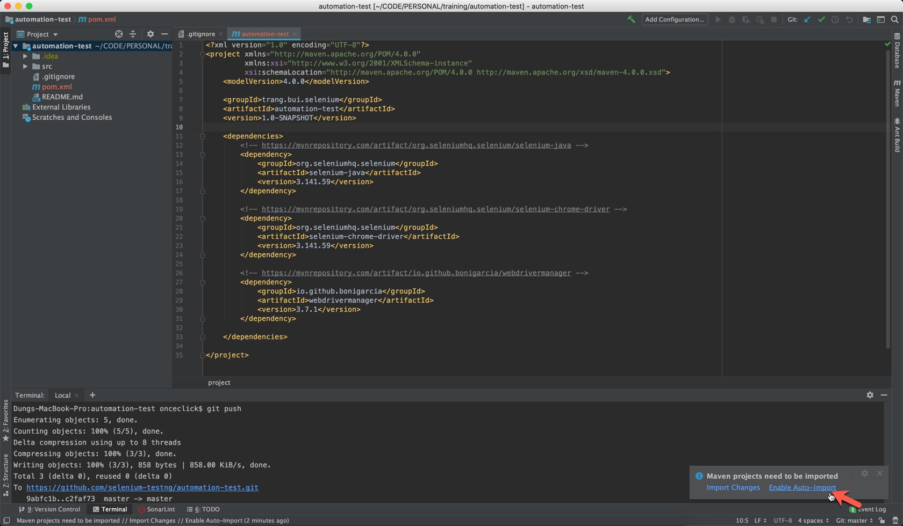

## 7. Do second commit & push code

``` bash
git status                          # Check current status
git add .                           # Mark all files read to commit
git status                          # Check status again
git commit -m 'Init maven project'  # Commit
git push                            # Push code to remote repo (Github)
```

## 8. Create project structure

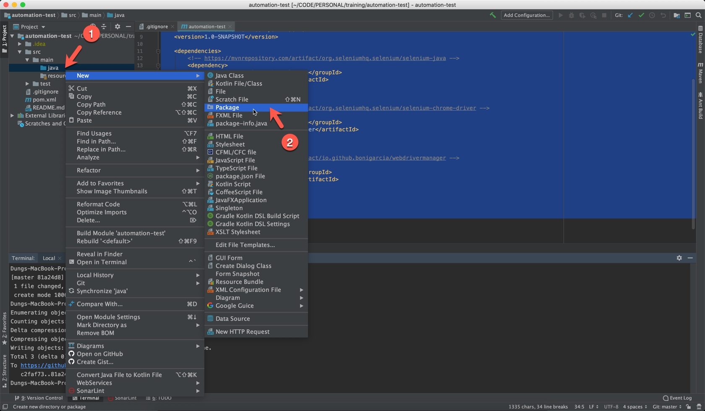

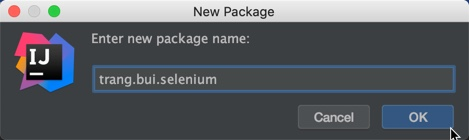

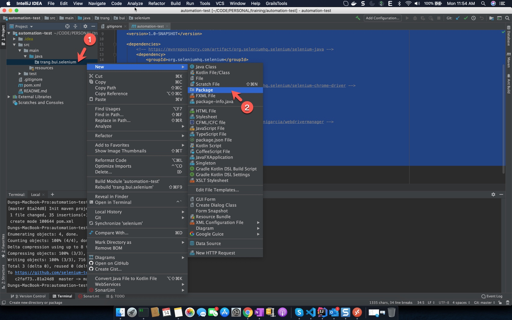


Change view to `Project Files` to see packages as folder:

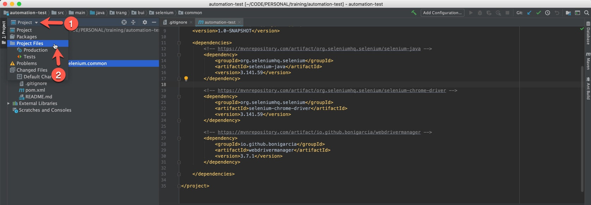

From trang.bui.selenium, create these packages:
- common
- framework
- page_objects
- test_cases
- test_suites


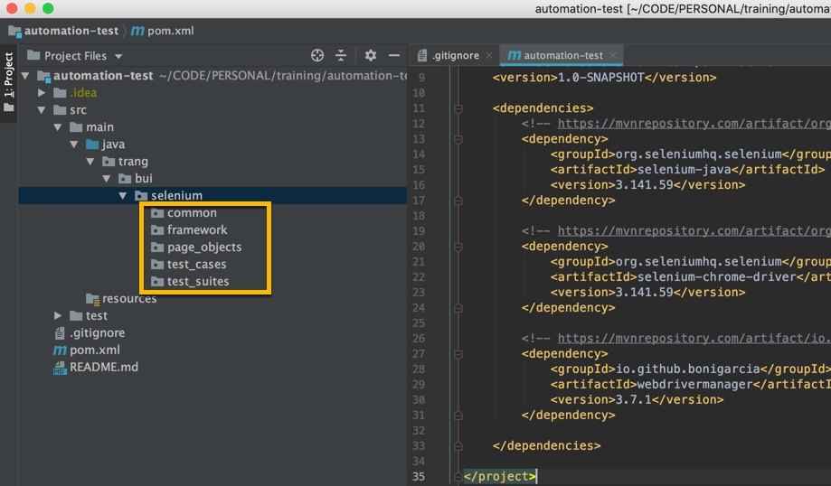

Change view to `Project` to see shorted package path: 

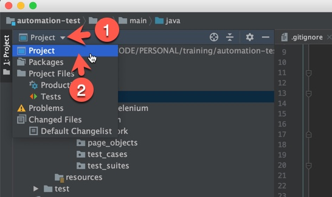

## 9. Create Constants class in common package

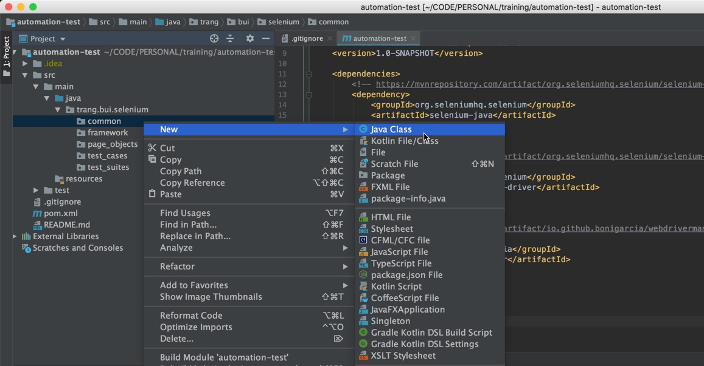

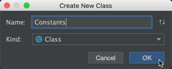

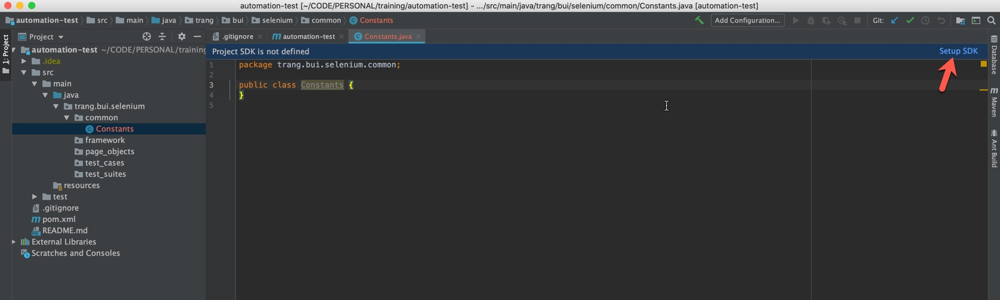

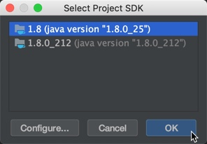

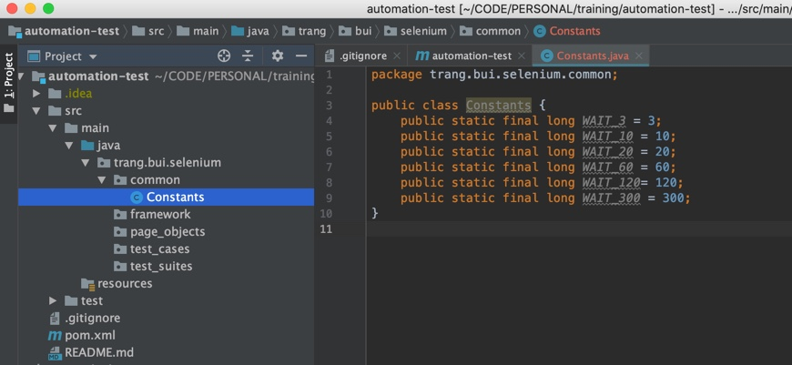

```java
package trang.bui.selenium.common;

public class Constants {
    public static final int TITLE_BOX_WIDTH = 70;
    public static final int TITLE_TEXT_WIDTH = 60;

    // Selenium configs
    public static final int WAIT_3 = 3;
    public static final int WAIT_10 = 10;
    public static final int WAIT_20 = 20;
    public static final int WAIT_60 = 60;
    public static final int WAIT_120= 120;
    public static final int WAIT_300 = 300;
    public static final String BROWSER = Configs.getProperty("browser");
    public static final boolean HEADLESS = Boolean.valueOf(Configs.getProperty("headless"));
    public static final boolean DISABLE_PDF_VIEWER = Boolean.valueOf(Configs.getProperty("disable_pdf_viewer"));
    public static final boolean MAXIMIZE_WINDOW = Boolean.valueOf(Configs.getProperty("maximize_window"));
    public static final int IMPLICITLY_WAIT = Integer.valueOf(Configs.getProperty("implicitly_wait_in_seconds"));

    // Log configs
    public static final String LOG_FILE_NAME_FORMAT = Configs.getProperty("log_filename_format");

    // Resources name
    public static final String LOG4J_FILE = "log4j.xml";
    public static final String CONFIG_FILE = "application.properties";
}
```

## 10. Create MyStringUtils class in common

This is a small string utility.

```java
package trang.bui.selenium.common;

import org.apache.commons.lang3.StringUtils;

public class MyStringUtils {
    //Default Constructor
    private MyStringUtils() {}
    
    public static String asterisk(int num) {
        return StringUtils.repeat("*", num);
    }

    public static String asterisk() {
        return StringUtils.repeat("*", Constants.TITLE_BOX_WIDTH);
    }

    public static String dash() {
        return StringUtils.repeat("-", Constants.TITLE_BOX_WIDTH);
    }


    public static String centerTitleWith$(String title, int size, String padStr) {

        return StringUtils.center(StringUtils.center(title, Constants.TITLE_TEXT_WIDTH, ' '), size, padStr);
    }

    public static String centerTitleWith$(String title) {
        return centerTitleWith$(title, Constants.TITLE_BOX_WIDTH, "$");
    }

    public static String centerTitleWithDash(String title) {
        return centerTitleWith$(title, Constants.TITLE_BOX_WIDTH, "=");
    }

}
```

## 11. Create MyDebug class in common

This small class will find classname which call a method. 

```java
package trang.bui.selenium.common;

public class MyDebug {
    /**
     * Find classname which call Log method
     * @return
     */
    public static String getCallerClassName() {
        StackTraceElement[] stackTraceElements = Thread.currentThread().getStackTrace();
        String callerClassName = null;
        for (int i=1; i<stackTraceElements.length; i++) {
            StackTraceElement stackTraceElement = stackTraceElements[i];
            if (!stackTraceElement.getClassName().equals(MyDebug.class.getName())&& stackTraceElement.getClassName().indexOf("java.lang.Thread")!=0) {
                if (callerClassName==null) {
                    callerClassName = stackTraceElement.getClassName();
                } else if (!callerClassName.equals(stackTraceElement.getClassName())) {
                    return stackTraceElement.getClassName();
                }
            }
        }
        return null;
    }
}
```

## 12. Update POM.xml to support slf4j, testNG, lombok

- **slf4j**: This is a log wrapper. It helps us collect information about how the application is running and also helps us debug if any failure occurs.
- **lombok**: a library help us to simplify Java Code. Example: we do not need to write getter and setter in a class. We need to install lombok plugin in IntelliJ by `IntelliJ IDEA\Preferences\Plugins\Search & Install`
  
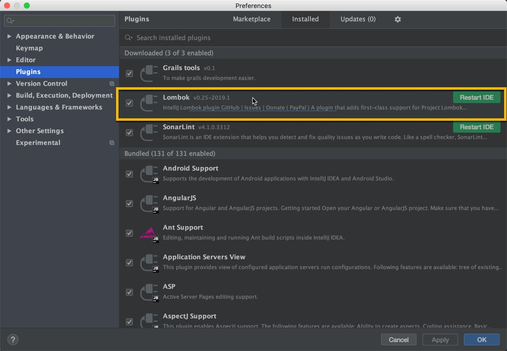

- **testNG**: a test framework. Support to write and run tests.

Update POM.xml to support these libraries:
```xml
<?xml version="1.0" encoding="UTF-8"?>
<project xmlns="http://maven.apache.org/POM/4.0.0"
         xmlns:xsi="http://www.w3.org/2001/XMLSchema-instance"
         xsi:schemaLocation="http://maven.apache.org/POM/4.0.0 http://maven.apache.org/xsd/maven-4.0.0.xsd">
    <modelVersion>4.0.0</modelVersion>

    <groupId>trang.bui.selenium</groupId>
    <artifactId>automation-test</artifactId>
    <version>1.0-SNAPSHOT</version>
    <build>
        <resources>
            <resource>
                <directory>src/main/resources</directory>
            </resource>
        </resources>
        <plugins>
            <plugin>
                <groupId>org.apache.maven.plugins</groupId>
                <artifactId>maven-compiler-plugin</artifactId>
                <version>3.6.1</version>
                <configuration>
                    <source>1.8</source>
                    <target>1.8</target>
                </configuration>
            </plugin>
        </plugins>
    </build>

    <dependencies>
        <!-- https://mvnrepository.com/artifact/org.seleniumhq.selenium/selenium-java -->
        <dependency>
            <groupId>org.seleniumhq.selenium</groupId>
            <artifactId>selenium-java</artifactId>
            <version>3.141.59</version>
        </dependency>

        <!-- https://mvnrepository.com/artifact/org.seleniumhq.selenium/selenium-chrome-driver -->
        <dependency>
            <groupId>org.seleniumhq.selenium</groupId>
            <artifactId>selenium-chrome-driver</artifactId>
            <version>3.141.59</version>
        </dependency>

        <!-- https://mvnrepository.com/artifact/io.github.bonigarcia/webdrivermanager -->
        <dependency>
            <groupId>io.github.bonigarcia</groupId>
            <artifactId>webdrivermanager</artifactId>
            <version>3.7.1</version>
        </dependency>

        <!-- https://mvnrepository.com/artifact/org.testng/testng -->
        <dependency>
            <groupId>org.testng</groupId>
            <artifactId>testng</artifactId>
            <version>6.14.3</version>
        </dependency>

        <!-- https://mvnrepository.com/artifact/org.slf4j/slf4j-api -->
        <dependency>
            <groupId>org.slf4j</groupId>
            <artifactId>slf4j-api</artifactId>
            <version>1.7.26</version>
        </dependency>

        <!-- https://mvnrepository.com/artifact/org.slf4j/slf4j-log4j12 -->
        <dependency>
            <groupId>org.slf4j</groupId>
            <artifactId>slf4j-log4j12</artifactId>
            <version>1.7.26</version>
        </dependency>

        <!-- https://mvnrepository.com/artifact/org.projectlombok/lombok -->
        <dependency>
            <groupId>org.projectlombok</groupId>
            <artifactId>lombok</artifactId>
            <version>1.18.10</version>
        </dependency>

    </dependencies>

</project>
```

## 13. Create application.properties and log4j.xml in Resource folder.

Resources folder is a place to store config files, resource files.
- **apllications.properties**: will be our config file.
- **log4j.xml**: is the config for log4j library.

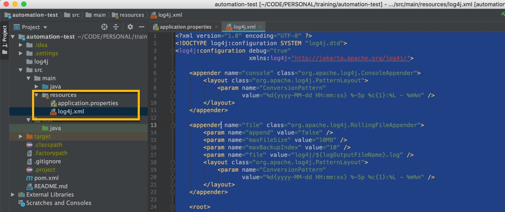

**application.properties**
```bash
# Browser configs
browser = chrome
headless = false
disable_pdf_viewer = false
maximize_window = true
implicitly_wait_in_seconds = 30

# DateTime configs
log_filename_format = yyyy_MM_dd_HH_mm_ss
```
**log4j.xml**
```xml
<?xml version="1.0" encoding="UTF-8" ?>
<!DOCTYPE log4j:configuration SYSTEM "log4j.dtd">
<log4j:configuration debug="true"
                     xmlns:log4j='http://jakarta.apache.org/log4j/'>

    <appender name="console" class="org.apache.log4j.ConsoleAppender">
        <layout class="org.apache.log4j.PatternLayout">
            <param name="ConversionPattern"
                   value="%d{yyyy-MM-dd HH:mm:ss} %-5p %c{1}:%L - %m%n" />
        </layout>
    </appender>

    <appender name="file" class="org.apache.log4j.RollingFileAppender">
        <param name="append" value="false" />
        <param name="maxFileSize" value="10MB" />
        <param name="maxBackupIndex" value="10" />
        <param name="file" value="log4j/${logOutputFileName}.log" />
        <layout class="org.apache.log4j.PatternLayout">
            <param name="ConversionPattern"
                   value="%d{yyyy-MM-dd HH:mm:ss} %-5p %c{1}:%L - %m%n" />
        </layout>
    </appender>

    <root>
        <level value="INFO" />
        <appender-ref ref="console" />
        <appender-ref ref="file" />
    </root>

</log4j:configuration>

```

## 14. Create Resources class in common

This class will help to read resources path. This class use lombok `@Getter` and `@Setter` so we do not need to write getter and setter for each properties. Example: we will have getLOG4J_PATH, getCONFIG_PATH method without definition.

```java
package trang.bui.selenium.common;

import lombok.Getter;
import lombok.Setter;

@Getter @Setter
public class Resources {
    private String LOG4J_PATH;
    private String CONFIG_PATH;
    public Resources() {
        LOG4J_PATH = this.getClass().getClassLoader().getResource(Constants.LOG4J_FILE).getPath();
        CONFIG_PATH = this.getClass().getClassLoader().getResource(Constants.CONFIG_FILE).getPath();
    }
}

```

## 15. Create Configs class in common

This class help to read config values from application.properties.

```java
package trang.bui.selenium.common;

import java.io.FileInputStream;
import java.io.IOException;
import java.util.Properties;

public class Configs {
    private static final Properties properties;

    static {
        properties = new Properties();
        try {
            FileInputStream fileInputStream = new FileInputStream(new Resources().getCONFIG_PATH());
            properties.load(fileInputStream);
        } catch (IOException e) {
            throw new RuntimeException("Failed to read configuration file!!!");
        }
    }
    private Configs() {}

    public static String getProperty(String key) {
        try {
            return properties.getProperty(key);
        } catch (Exception e) {
            return "";
        }
    }
}

```

## 16. Create MyDateUtils class n common

Any function related to DateTime will be put here.

```java
package trang.bui.selenium.common;

import java.text.DateFormat;
import java.text.SimpleDateFormat;
import java.util.Date;

public class MyDateUtils {
    public static String getTodayWithFormat(String format) {
        DateFormat dateFormat = new SimpleDateFormat(format);
        return dateFormat.format(new Date());
    }
}
```

## 17. Create Log class in common

This class will provide function to print logs.

```java
package trang.bui.selenium.common;

import org.apache.log4j.xml.DOMConfigurator;
import org.slf4j.Logger;
import org.slf4j.LoggerFactory;

public class Log {
    private static Logger logger = null;

    // Execute only one time when calling a method first time.
    static {
        // Only use Basic config if no exist log4j.xml
        // BasicConfigurator.configure();
    }

    private static void getCallerClass() {
        logger = LoggerFactory.getLogger(MyDebug.getCallerClassName());
    }

    public static void configure() {
        System.setProperty("logOutputFileName", MyDateUtils.getTodayWithFormat(Constants.LOG_FILE_NAME_FORMAT));
        DOMConfigurator.configure(new Resources().getLOG4J_PATH());
    }

    public static void configure(String classname) {
        System.setProperty("logOutputFileName", classname + "_" + MyDateUtils.getTodayWithFormat(Constants.LOG_FILE_NAME_FORMAT));
        DOMConfigurator.configure(new Resources().getLOG4J_PATH());
    }

    public static void startTestCase(String sTestCaseName, String sOS, String sBrowser) {
        getCallerClass();
        logger.info(MyStringUtils.asterisk());
        logger.info(MyStringUtils.centerTitleWith$(sTestCaseName));
        logger.info(MyStringUtils.centerTitleWith$(sOS + " - " + sBrowser));
        logger.info(MyStringUtils.asterisk());
    }

    public static void endTestCase() {
        getCallerClass();
        logger.info(MyStringUtils.asterisk());
        logger.info(MyStringUtils.centerTitleWith$("END"));
        logger.info(MyStringUtils.asterisk());
    }

    public static void startSection(String message) {
        getCallerClass();
        logger.info(MyStringUtils.dash());
        logger.info("[SECTION]: " + message);
        logger.info(MyStringUtils.dash());
    }

    // Log level: ALL < DEBUG < INFO < WARN < ERROR < FATAL

    public static void info(String message) {
        getCallerClass();
        logger.info(message);
    }

    public static void warn(String message) {
        getCallerClass();
        logger.warn(message);
    }

    public static void error(String message) {
        getCallerClass();
        logger.error(message);
    }

}

```

## 18. Create DeveloperTesting in trang.bui.selenium to test our function

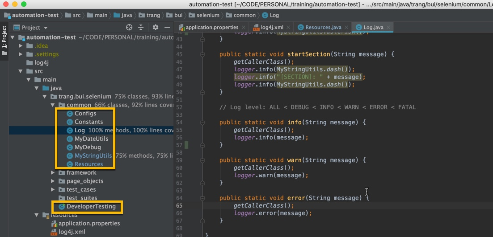

```java
package trang.bui.selenium;

import trang.bui.selenium.common.Constants;
import trang.bui.selenium.common.Log;

public class DeveloperTesting {
    public static void main(String[] arg) {
        Log.configure();
        Log.startTestCase("TestSuite 1", "MAC", "Chrome");
        Log.startSection("Test Home Page");
        Log.startSection("Test Login Page");
        Log.info("Browser from config: " + Constants.BROWSER);
        Log.warn("This is a warning message");
        Log.error("This is an error message");
        Log.endTestCase();
    }
}

```

Run this class and see the result:

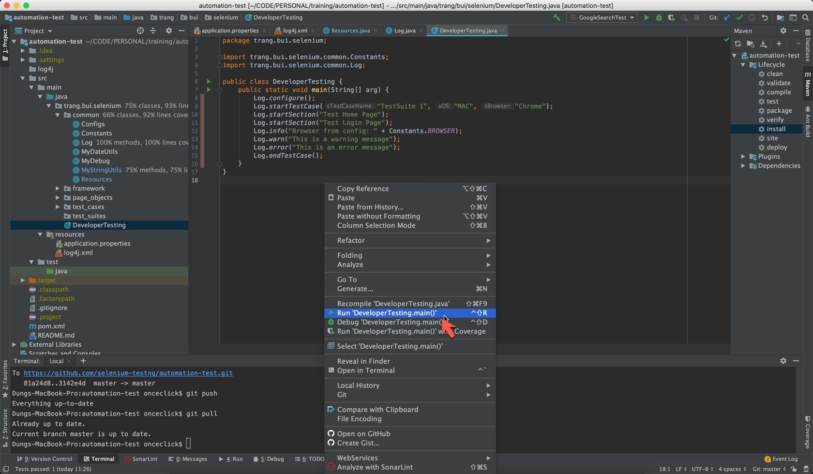

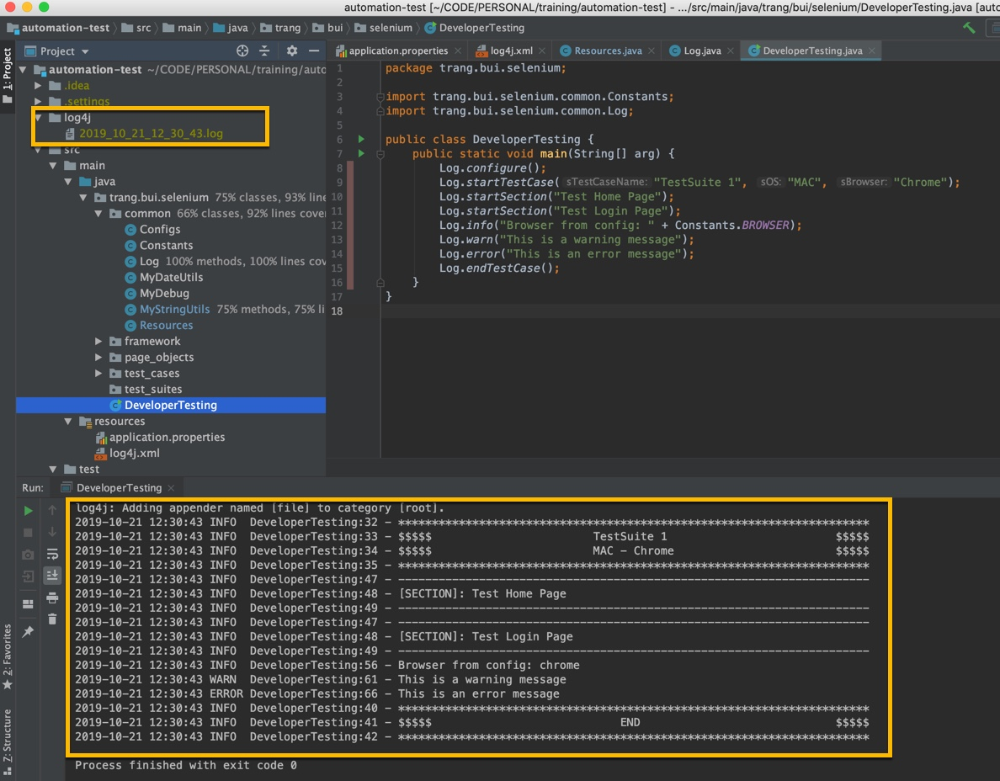

## 19. Create BasePage in framework package

All webpages will be extended from this class

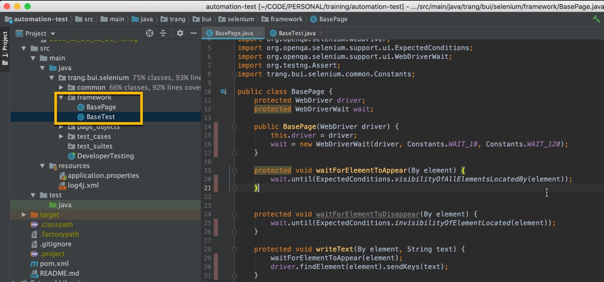

```java
package trang.bui.selenium.framework;

import org.openqa.selenium.By;
import org.openqa.selenium.WebDriver;
import org.openqa.selenium.support.ui.ExpectedConditions;
import org.openqa.selenium.support.ui.WebDriverWait;
import org.testng.Assert;
import trang.bui.selenium.common.Constants;

public class BasePage {
    protected WebDriver driver;
    protected WebDriverWait wait;

    public BasePage(WebDriver driver) {
        this.driver = driver;
        wait = new WebDriverWait(driver, Constants.WAIT_10, Constants.WAIT_120);
    }

    protected void waitForElementToAppear(By element) {
        wait.until(ExpectedConditions.visibilityOfAllElementsLocatedBy(element));
    }


    protected void waitForElementToDisappear(By element) {
        wait.until(ExpectedConditions.invisibilityOfElementLocated(element));
    }

    protected void writeText(By element, String text) {
        waitForElementToAppear(element);
        driver.findElement(element).sendKeys(text);
    }

    protected String readText(By element) {
        waitForElementToAppear(element);
        return driver.findElement(element).getText();
    }

    protected void click (By element) {
        waitForElementToAppear(element);
        driver.findElement(element).click();
    }

    protected void assertEquals(By element, String expectedText) {
        waitForElementToAppear(element);
        Assert.assertEquals(readText(element), expectedText);
    }
}

```

## 20. Create BaseTest in framework pagekage

All tests will be extended from this class.

```java
package trang.bui.selenium.framework;

import io.github.bonigarcia.wdm.WebDriverManager;
import org.openqa.selenium.PageLoadStrategy;
import org.openqa.selenium.WebDriver;
import org.openqa.selenium.chrome.ChromeDriver;
import org.openqa.selenium.chrome.ChromeOptions;
import org.openqa.selenium.edge.EdgeDriver;
import org.openqa.selenium.firefox.FirefoxDriver;
import org.openqa.selenium.firefox.FirefoxOptions;
import org.openqa.selenium.firefox.FirefoxProfile;
import org.openqa.selenium.ie.InternetExplorerDriver;
import org.openqa.selenium.remote.CapabilityType;
import org.openqa.selenium.remote.DesiredCapabilities;
import org.openqa.selenium.safari.SafariDriver;
import org.testng.annotations.AfterClass;
import org.testng.annotations.BeforeClass;
import trang.bui.selenium.common.Constants;
import trang.bui.selenium.common.Log;

import java.util.HashMap;
import java.util.Map;
import java.util.concurrent.TimeUnit;

public class BaseTest {
    public static WebDriver driver;

    @BeforeClass
    public void beforeClass() {
        setupDriver();
        Log.configure();
        Log.startTestCase(this.getClass().getSimpleName(), System.getProperty("os.name"), Constants.BROWSER);
    }

    @AfterClass
    public void afterClass() {
        Log.endTestCase();
        driver.quit();
    }

    public void setupDriver() {
        Log.info("Setup Browser driver");
        switch (Constants.BROWSER.toLowerCase()) {
            case "chrome":
                WebDriverManager.chromedriver().setup();

                ChromeOptions chromeOptions = new ChromeOptions();
                chromeOptions.addArguments("--no-sandbox");
                chromeOptions.addArguments("--disable-infobars");
                chromeOptions.addArguments("--disable-extensions");
                chromeOptions.addArguments("--disable-web-security");
                chromeOptions.addArguments("--no-proxy-server");
                chromeOptions.addArguments("--enable-automation");
                chromeOptions.addArguments("--ignore-certificate-errors");
                chromeOptions.addArguments("--enable-precise-memory-info");
                chromeOptions.addArguments("--ignore-ssl-errors=true");
                chromeOptions.addArguments("--allow-insecure-localhost");
                chromeOptions.setPageLoadStrategy(PageLoadStrategy.NORMAL);
                chromeOptions.setAcceptInsecureCerts(true);

                if(Constants.HEADLESS) {
                    chromeOptions.addArguments("--headless");
                    chromeOptions.addArguments("--disable-gpu");
                    chromeOptions.addArguments("--window-size=1980,1080");
                }

                DesiredCapabilities desiredCapabilities = null;
                desiredCapabilities = DesiredCapabilities.chrome();
                desiredCapabilities.setCapability(CapabilityType.ACCEPT_SSL_CERTS, true);
                desiredCapabilities.setCapability(CapabilityType.ACCEPT_INSECURE_CERTS, true);
                desiredCapabilities.setCapability(CapabilityType.ForSeleniumServer.ENSURING_CLEAN_SESSION, true);
                desiredCapabilities.setCapability("javascriptEnabled", true);

                Map<String, Object> chromePreferences = new HashMap<String, Object>();
                chromePreferences.put("credentials_enable_service", false);
                chromePreferences.put("profile.password_manager_enabled", false);

                if(Constants.DISABLE_PDF_VIEWER) {
                    chromePreferences.put("plugins.always_open_pdf_externally", false);
                    desiredCapabilities.setCapability("plugins.plugins_disabled","Chrome PDF Viewer");
                }

                chromeOptions.setExperimentalOption("prefs", chromePreferences);

                desiredCapabilities.setCapability(ChromeOptions.CAPABILITY, chromeOptions);
                driver = new ChromeDriver(chromeOptions);
                break;

            case "firefox":
                WebDriverManager.firefoxdriver().setup();
                FirefoxOptions firefoxOptions = new FirefoxOptions();
                firefoxOptions.setProfile(new FirefoxProfile());

                if(Constants.DISABLE_PDF_VIEWER) {
                    firefoxOptions.addPreference("plugin.disable_full_page_plugin_for_types", "application/pdf,application/vnd.adobe.xfdf,application/vnd.fdf,application/vnd.adobe.xdp+xml");
                    firefoxOptions.addPreference("pdfjs.disabled", true);
                    firefoxOptions.addPreference("browser.helperApps.neverAsk.saveToDisk", "text/csv,application/pdf,application/csv,application/vnd.ms-excel");
                }

                if(Constants.HEADLESS) {
                    firefoxOptions.setHeadless(true);
                }

                driver = new FirefoxDriver(firefoxOptions);

            case "ie":
                WebDriverManager.iedriver().setup();
                driver = new InternetExplorerDriver();
                break;

            case "edge":
                WebDriverManager.edgedriver().setup();
                driver = new EdgeDriver();
                break;

            case "safari":
                driver = new SafariDriver();
                break;

        }

        if(Constants.MAXIMIZE_WINDOW) {
            driver.manage().window().maximize();
        }

        driver.manage().deleteAllCookies();

        // Set timeout to wait for an element to appear
        // Find more at: https://www.guru99.com/implicit-explicit-waits-selenium.html
        driver.manage().timeouts().implicitlyWait(Constants.IMPLICITLY_WAIT, TimeUnit.SECONDS);
    }
}

```

## 21. Use this framework to search Google.com

We now have BaseTest and BasePage class.
- All new pages will be extended from BasePage class.
- All new tests will be extended from BaseTest class.
- New pages will be created in page_objects package.
- New tests will be created in test_cases packages.

BaseTest will help to init selenium driver. Then pass this driver to BasePage. 

We will create a simple search on google.com.

### 21.1. Create GoogleSearchPage in page_objects package

```java
package trang.bui.selenium.page_objects;

import org.openqa.selenium.By;
import org.openqa.selenium.WebDriver;
import trang.bui.selenium.framework.BasePage;

public class GoogleSearchPage extends BasePage {

    public GoogleSearchPage(WebDriver driver) {
        super(driver);
    }

    String baseURL = "https://www.google.com/";
    By searchInput = By.name("q");
    By searchButton = By.name("btnK");

    public GoogleSearchPage goToGoogleSearchPage() {
        driver.get(baseURL);
        return this;
    }

    public void doSearch(String text) {
        writeText(searchInput, text);
        click(searchButton);
    }
}

```

### 21.2. Create GoogleSearchTest in test_cases package to auto search

```java
package trang.bui.selenium.test_cases;

import org.testng.annotations.AfterMethod;
import org.testng.annotations.BeforeMethod;
import org.testng.annotations.Test;
import trang.bui.selenium.common.Log;
import trang.bui.selenium.framework.BaseTest;
import trang.bui.selenium.page_objects.GoogleSearchPage;

public class GoogleSearchTest extends BaseTest {
    private GoogleSearchPage googleSearchPage;

    @BeforeMethod
    public void setup(){
        Log.info("Run @BeforeMethod");
        googleSearchPage = new GoogleSearchPage(driver);
    }

    @Test
    public void test(){
        Log.info("Run @Test");
        googleSearchPage.goToGoogleSearchPage();
        googleSearchPage.doSearch("selenium page objects model");
    }

    @AfterMethod
    public void teardown(){
        Log.info("Run @AfterMethod");
        System.out.println("After Method");
    }
}

```

Our current project structure:

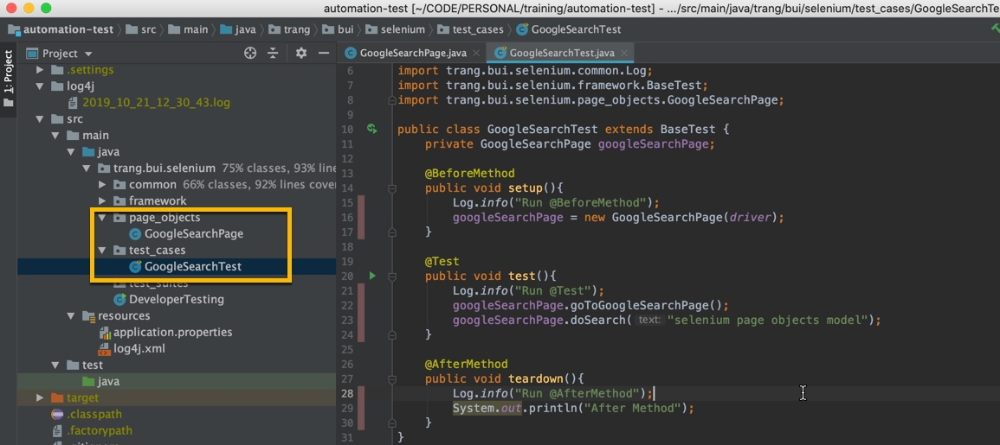

### 21.3. Run a test

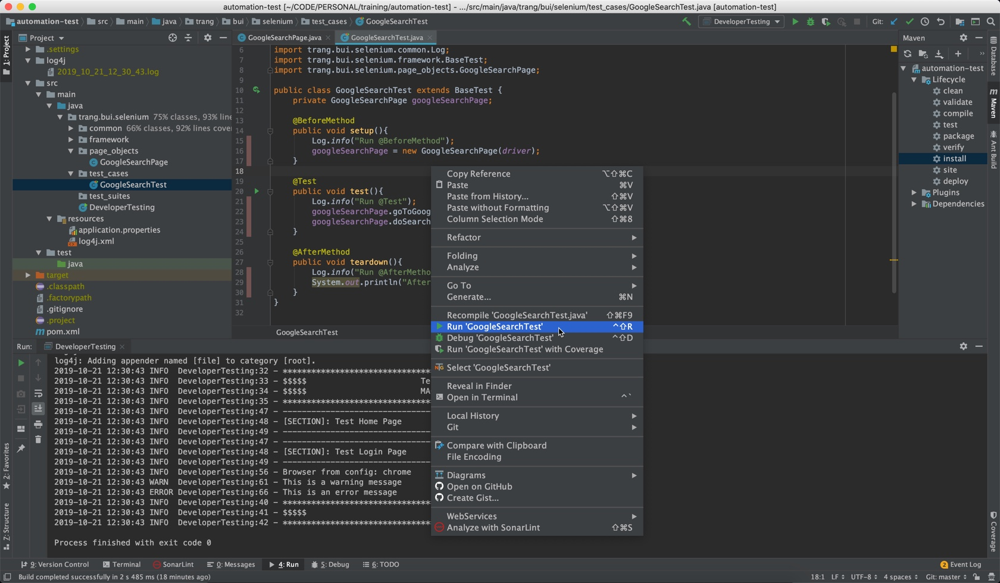

View the output log file after run test.
