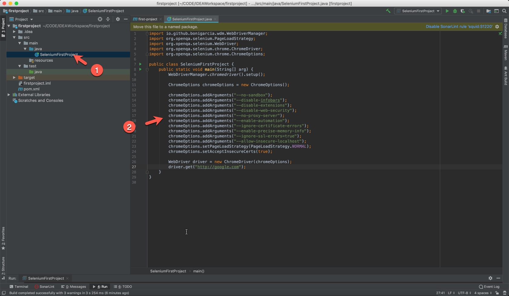

# Selenium

## Basic features
- Open Source Automation Testing tool,
- Exclusively for Web Based applications,
- Support multiple:
  - Browsers: Chrome, Firefox, IE, Safari
  - Platforms: Window, OSX, Linux
  - Languages: Java, C#, Python, JS, PHP, Ruby

## How Selenium works


## Setup Environment
### 1. Java
- Install Java JDK,
- Configure JAVA_HOME & Java path

  - Windows: 
  ``` Bash
  echo %JAVA_HOME%              # View JAVA_HOME
  javac -version                # View Java version
  setx -m JAVA_HOME "C:\Program files\Java\jdk1.8.0_XX"
  ```
  - MAC: 
  ``` Bash
  echo $JAVA_HOME       # View JAVA_HOME
  which java            # Locate java
  export JAVA_HOME=$(/path_to_java_home)    # Add to ~/.bash_profile
  ```
### 2. Install IntelliJ or Eclipse

## First Project with Selenium - Hello Google
### 1. Create a new Maven Project


### 2. Hello World


Hello World
``` java
public static void main(String[] arg) {
    System.out.println("Hello world");
}
```


### 3. Add Selenium to pom.xml


``` xml
<dependencies>
    <!-- https://mvnrepository.com/artifact/org.seleniumhq.selenium/selenium-java -->
    <dependency>
        <groupId>org.seleniumhq.selenium</groupId>
        <artifactId>selenium-java</artifactId>
        <version>3.141.59</version>
    </dependency>

    <!-- https://mvnrepository.com/artifact/org.seleniumhq.selenium/selenium-chrome-driver -->
    <dependency>
        <groupId>org.seleniumhq.selenium</groupId>
        <artifactId>selenium-chrome-driver</artifactId>
        <version>3.141.59</version>
    </dependency>

    <!-- https://mvnrepository.com/artifact/io.github.bonigarcia/webdrivermanager -->
    <dependency>
        <groupId>io.github.bonigarcia</groupId>
        <artifactId>webdrivermanager</artifactId>
        <version>3.7.1</version>
    </dependency>
</dependencies>
```


### 4. Hello Google



``` java
WebDriverManager.chromedriver().setup();

        ChromeOptions chromeOptions = new ChromeOptions();

        chromeOptions.addArguments("--no-sandbox");
        chromeOptions.addArguments("--disable-infobars");
        chromeOptions.addArguments("--disable-extensions");
        chromeOptions.addArguments("--disable-web-security");
        chromeOptions.addArguments("--no-proxy-server");
        chromeOptions.addArguments("--enable-automation");
        chromeOptions.addArguments("--ignore-certificate-errors");
        chromeOptions.addArguments("--enable-precise-memory-info");
        chromeOptions.addArguments("--ignore-ssl-errors=true");
        chromeOptions.addArguments("--allow-insecure-localhost");
        chromeOptions.setPageLoadStrategy(PageLoadStrategy.NORMAL);
        chromeOptions.setAcceptInsecureCerts(true);

        WebDriver driver = new ChromeDriver(chromeOptions);
        driver.get("http://google.com");
```

Run to see the result!!!